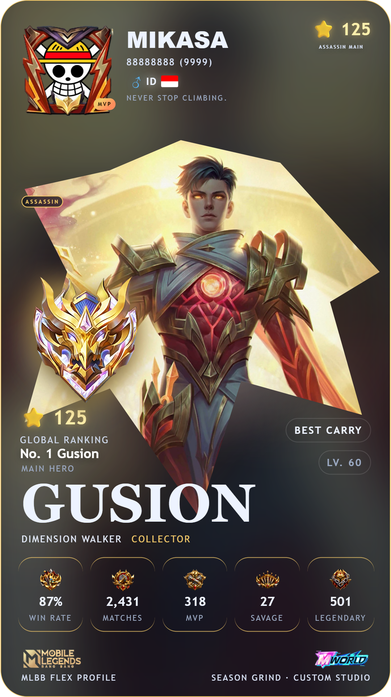

# MLBB Flex Profile Studio

<p align="center">
  <strong>A cinematic Mobile Legends: Bang Bang profile-card generator built for custom player profile designs.</strong>
</p>

<p align="center">
  Create a personalized MLBB-style profile card, customize the visual composition, and export the final result as a PNG.
</p>

---

## Preview

<p align="center">
  
</p>

> Example profile generated with MLBB Flex Profile Studio.

---

## ✨ Features

### 👤 Player Identity

Customize the main player information displayed on the card:

- IGN / Player Name
- Player ID
- Server
- Gender
- Country / Region
- Country flag
- Bio
- Player Title
- Rank
- Rank points
- Avatar
- Avatar border
- MVP badge

Long IGN text is automatically resized so it can remain inside the profile layout.

---

### 🦸 Hero & Skin

Build the profile around a selected hero and skin.

- Hero selector
- Skin selector
- Skin rarity
- Hero artwork
- Global ranking section
- Main hero information
- Skin accent color integration
- Hero artwork positioning

The selected skin can drive the visual accent used throughout the card.

---

### 🎨 Multiple Card Layouts

Choose between several visual compositions:

- **Classic**
- **Minimal**
- **Cyber**
- **Esports**
- **Mythic**
- **Showcase**

The layout changes the presentation of the profile without changing the underlying player data.

---

### 🖼️ Hero Artwork Position Control

Fine-tune the hero artwork directly from the editor:

| Control | Purpose |
|---|---|
| **X** | Move artwork horizontally |
| **Y** | Move artwork vertically |
| **Scale** | Increase or decrease artwork size |
| **Rotation** | Rotate artwork |

This makes it easier to compensate for different artwork compositions and focal points.

---

### 🌌 Background Effects

Add atmosphere behind the profile card with selectable effects:

- Particles
- Glow
- Smoke
- Light Rays
- Geometric Pattern
- Energy Ring

Effect intensity can be adjusted independently.

---

### 🏷️ Role Badge

Display a role badge on the profile:

- Assassin
- Mage
- Fighter
- Marksman
- Jungler
- Support
- Tank

The badge can be set manually or derived automatically from the selected hero.

---

### 👑 Player Title

Add a custom player title such as:

```text
SUPREME ASSASSIN
```

or:

```text
GUSION SPECIALIST
```

The title is rendered as part of the profile card and is included in the PNG export.

---

### 🖌️ Dynamic Skin Accent

The selected skin has priority for the card's visual accent.

The skin accent can be used for:

- Card border
- Border glow
- Role badge styling
- Badge styling
- Stage background atmosphere
- Other accent elements

Custom color controls remain available where supported, while the selected skin takes priority when skin-based styling is active.

---

### 🧩 Card Border Customization

Customize the profile-card border with:

- Solid color
- Gradient color
- Skin-based accent

When a skin is selected, its accent remains the primary visual source for the skin-driven border treatment.

---

### 📊 Player Statistics

Add custom profile statistics such as:

- Win Rate
- Matches
- MVP
- Savage
- Legendary
- Emblem Level

Statistic icons and values are presented as dedicated cards inside the profile.

---

### 🏆 Rank & Global Ranking

The profile supports:

- Rank artwork
- Rank name
- Rank points
- Global ranking label
- Main hero ranking
- Rank aura / visual treatment

Example:

```text
⭐ 125

GLOBAL RANKING
No. 1 Gusion
```

---

### 🎭 Avatar & Badge System

Customize the player identity area with:

- Custom avatar
- Avatar frame
- MVP badge
- Badge colors
- Country flag
- Gender indicator

---

### 🖼️ PNG Export

Export the finished profile directly as a PNG.

The exported image preserves the visual composition of the editor, including:

- Player identity
- Hero artwork
- Selected skin
- Player title
- Role badge
- Rank
- Statistics
- Background
- Effects
- Dynamic accents
- Card border

---

## 🛠️ Tech Stack

The project is intentionally lightweight and browser-based.

- **HTML5**
- **CSS3**
- **Vanilla JavaScript**
- Local asset catalog
- Canvas-based PNG export
- No framework required for the core editor

There is no React, Vue, Angular, or other frontend framework dependency required for the main interface.

---

## 📁 Project Structure

A simplified project structure:

```text
MLBB-Flex-Profile-Studio/
│
├── index.html
├── style.css
├── script.js
├── api.js
├── catalog-local.js
│
├── assets/
│   ├── archivement/
│   ├── border-avatar/
│   ├── ...
│
└── README.md
```

The exact asset folders may grow as additional player-profile resources are added.

---

## 🚀 Getting Started

### Option 1 — Run locally

Clone the repository:

```bash
git clone https://github.com/YOUR_USERNAME/YOUR_REPOSITORY.git
```

Open the project directory:

```bash
cd YOUR_REPOSITORY
```

Then open:

```text
index.html
```

in a modern browser.

For the most reliable local development experience, you can also serve the folder through a simple local HTTP server.

### VS Code / Live Server

If you use Visual Studio Code, the project can be opened with a local development server such as Live Server.

---

## 🎮 How to Use

### 1. Enter player information

Open the **Identity** section and configure:

```text
IGN
Player ID
Server
Bio
Title
Rank
Gender
Region
Rank Points
```

Upload your avatar if required.

---

### 2. Select hero and skin

Open the **Visual** section.

Choose:

```text
Role
Hero
Skin
Rarity
```

The selected skin can automatically influence the visual accent of the profile.

---

### 3. Customize the card

Use the visual controls to configure:

- Background
- Border
- Badge
- Avatar frame
- Emblem
- Role badge
- Skin colors
- Background colors

---

### 4. Position the hero artwork

Open the **Layout** section and adjust:

```text
X
Y
Scale
Rotation
```

until the artwork fits the composition.

---

### 5. Choose a card layout

Try:

```text
Classic
Minimal
Cyber
Esports
Mythic
Showcase
```

to find the visual style that fits the profile.

---

### 6. Add background effects

Select an effect such as:

```text
Particles
Glow
Smoke
Light Rays
Geometric Pattern
Energy Ring
```

Then adjust the intensity.

---

### 7. Export

When the profile is ready, use:

```text
Export PNG
```

to generate the final profile image.

---

## 🎨 Asset Usage

MLBB Flex Profile Studio is designed to be **asset-agnostic**.

You can provide your own:

- Hero artwork
- Avatar
- Avatar frames
- Rank artwork
- Badges
- Emblems
- Other visual assets

Only use artwork and other assets that you have the right or permission to use.

If you distribute this project publicly, make sure your asset sources and licensing comply with the rights associated with each asset.

---

## 📌 Design Philosophy

The project focuses on three principles:

### 1. Customization

The same player data should be able to produce different visual identities.

### 2. Skin-driven Visual Identity

The selected skin should influence the overall color language of the profile instead of forcing every profile to use one static color.

### 3. Export-ready Composition

The live preview should closely represent the final PNG so the profile can be used as a social-media graphic, showcase image, or personal profile artwork.

---

## 🗺️ Roadmap

Potential future improvements:

- More profile layouts
- More background effects
- More animation presets
- Additional artwork controls
- More advanced typography controls
- More export presets
- Additional profile statistics
- More customizable visual layers
- Preset sharing/importing
- More advanced skin-accent extraction

---

## ⚠️ Disclaimer

This project is an **unofficial fan-made profile generator** and is not affiliated with, endorsed by, or sponsored by Moonton or Mobile Legends: Bang Bang.

Mobile Legends: Bang Bang and related intellectual property belong to their respective owners.

Please respect the licenses, copyrights, and usage rights of any artwork or assets used with this project.

---

## 📄 License

Add the license that matches how you want this repository to be distributed.

For example:

```text
MIT License
```

If the repository contains third-party assets, make sure their individual licenses and usage restrictions are respected even if the source code itself uses an open-source license.

---

## ❤️ Credits

Built as a community-focused customization project for creating cinematic MLBB-style player profiles.

If you use this project, consider giving the repository a ⭐ on GitHub.

<p align="center">
  <strong>MLBB Flex Profile Studio</strong><br>
  <sub>Build your profile. Style your identity. Flex your main.</sub>
</p>
